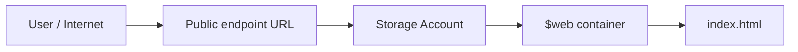

# Lab 01: Hosting a Static Website in Azure

Deploy a public website on **Azure Blob Storage** with no server to manage.

| | |
|---|---|
| **Difficulty** | Beginner |
| **Time** | ~30 minutes |
| **Region** | East US |
| **Cost** | Pennies (LRS storage, deleted after the lab) |

## Objective

Host a simple website using Azure Blob Storage static website hosting instead of a virtual machine. This introduces **PaaS** and **serverless** hosting: I supply the content, and Azure runs the infrastructure.

## Architecture

## Skills Demonstrated

- Creating and organizing resources with **resource groups**
- Deploying and configuring an **Azure Storage account**
- Enabling **static website hosting** on Blob Storage
- Understanding **PaaS / serverless** vs. VM-based hosting
- Choosing a storage **redundancy** option (LRS) for cost
- Following Azure naming conventions and cleaning up resources

## Resources Deployed

| Resource | Name |
|---|---|
| Resource group | `rg-lab01-<yourname>` |
| Storage account | `stlab01<yourname>` (globally unique, lowercase, no special characters) |
| Container | `$web` (auto-created) |

## Steps

1. **Create a resource group** `rg-lab01-<yourname>` in East US.
2. **Create a storage account** `stlab01<yourname>` with Standard performance and LRS redundancy.
3. **Enable static website** under *Data management → Static website*. Set index document to `index.html` and error document to `404.html`, then copy the primary endpoint URL.
4. **Create the site files.** See [`src/index.html`](./src/index.html) and [`src/404.html`](./src/404.html).
5. **Upload** the files to the `$web` container.
6. **Validate** by opening the primary endpoint URL in a browser.

## Result

*Add your own screenshots to `docs/screenshots/`. Suggested shots:*

| File name | What to capture |
|---|---|
| `01-website-live.png` | The site loading in the browser (include the URL bar) |
| `02-storage-account.png` | The storage account overview page |
| `03-static-website-enabled.png` | The Static website blade showing the endpoint |
| `04-web-container.png` | `$web` container with `index.html` uploaded |

## Troubleshooting

| Issue | Cause | Fix |
|---|---|---|
| 404 - content does not exist | Wrong filename or wrong container | File must be exactly `index.html` (case-sensitive) and inside `$web` |
| Storage account name already taken | Names are unique across all of Azure | Append numbers, e.g. `stlab01name99` |

## Clean Up

Delete the resource group to remove everything at once:

*Resource Groups → `rg-lab01-<yourname>` → Delete resource group → type the name to confirm.*

## What I Learned

- Static sites don't need a server: Blob Storage can serve files directly from the `$web` container.
- Storage account names are globally unique, and Azure paths are case-sensitive.
- LRS is the cheapest redundancy option, fine for labs but not for production resilience.
- Deleting the resource group is the cleanest way to avoid leftover costs.

## Possible Next Steps

- Add a custom domain and HTTPS with Azure CDN or Front Door
- Automate this deployment with Terraform or Azure CLI
- Set up a GitHub Actions workflow to deploy on every push
