# Lab 04: Infrastructure as Code with Terraform

I stopped clicking through the Azure portal and described my infrastructure in a plain text file instead. **Terraform** read that file and built a resource group, virtual network, and subnet, then I changed the live environment by adding one block of code, and finally tore everything down with a single command.

| | |
|---|---|
| **Difficulty** | Beginner |
| **Time** | About 20 minutes (my run: 12:32 PM to 12:48 PM) |
| **Region** | East US |
| **Concepts** | Infrastructure as Code, declarative config, Terraform state, init / plan / apply / destroy |

---

## Objective

Use Terraform in Azure Cloud Shell to deploy a resource group, VNet, and subnet from a single `main.tf` file, verify the result in the portal, add a Network Security Group to the running environment without touching the existing resources, and then destroy everything cleanly through Terraform rather than the portal.

## Architecture

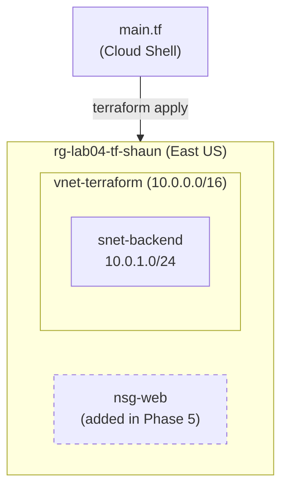

Each resource block in `main.tf` references the one it depends on (for example `azurerm_resource_group.rg.name`). I never wrote "create the VNet after the resource group" — Terraform worked out the build order from those references.

## Skills Demonstrated

- Writing a Terraform configuration with a **provider block** and multiple **resource blocks**
- Using **resource references** so Terraform infers dependency order automatically
- Running the full Terraform workflow: **init → plan → apply → destroy**
- Reading a `terraform plan` before approving any change
- Making an **incremental change** to live infrastructure (1 to add, nothing else touched)
- Understanding the role of the **state file** (`terraform.tfstate`)
- Tearing down infrastructure through code so config, state, and Azure stay in sync

## Resources Deployed

| Resource | Name | Notes |
|---|---|---|
| Resource group | `rg-lab04-tf-shaun` | East US |
| Virtual network | `vnet-terraform` | Address space `10.0.0.0/16` |
| Subnet | `snet-backend` | `10.0.1.0/24` |
| Network security group | `nsg-web` | Added in Phase 5, no custom rules |
| Provider | `hashicorp/azurerm` | v3.117.1, pinned by `~> 3.0` |

The full configuration is in [`terraform/main.tf`](./terraform/main.tf).

---

## Walkthrough

### Phase 1: Open Cloud Shell

Opened Cloud Shell from the `>_` icon in the portal toolbar, confirmed it was in **Bash** mode, and created a project folder.

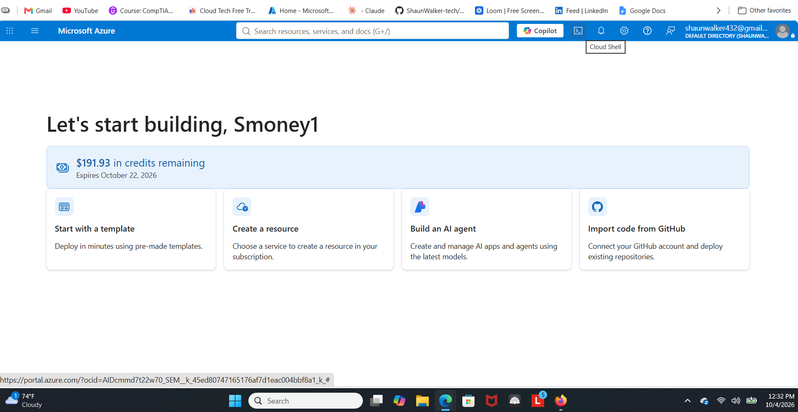

```bash
mkdir terraform-lab
cd terraform-lab
```

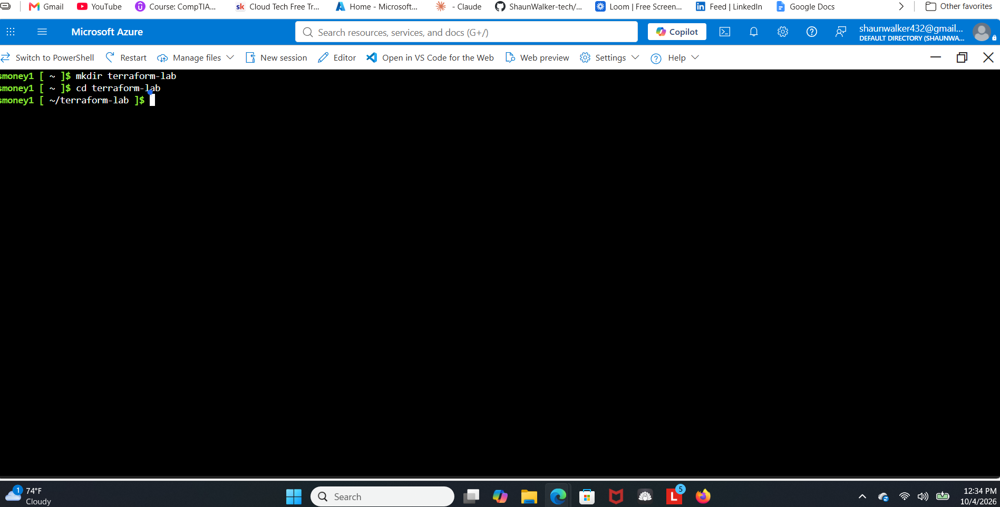

### Phase 2: Write the configuration

```bash
code main.tf
```

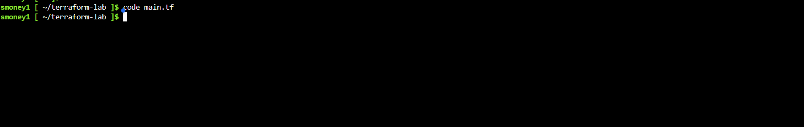

I pasted in the provider block and three resource blocks, set the resource group name to `rg-lab04-tf-shaun`, and saved with `Ctrl+S`.

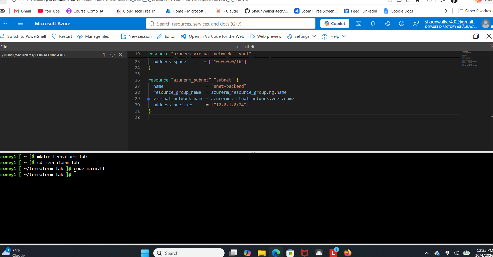

To make sure the file actually saved and wasn't empty, I printed it back out:

```bash
cat main.tf
```

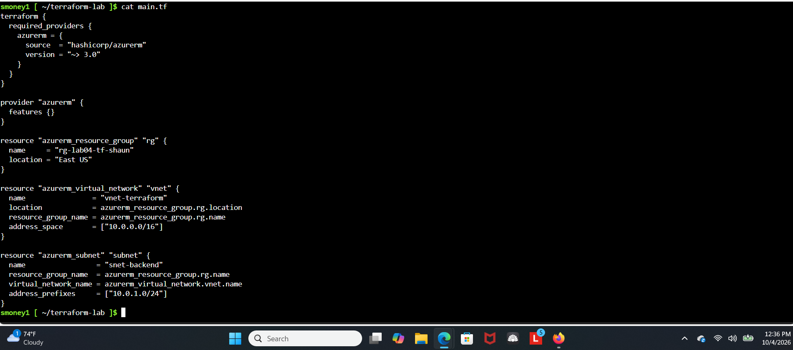

### Phase 3: Deploy

**`terraform init`** downloaded the AzureRM provider (v3.117.1, signed by HashiCorp) and created `.terraform.lock.hcl` to pin that version.

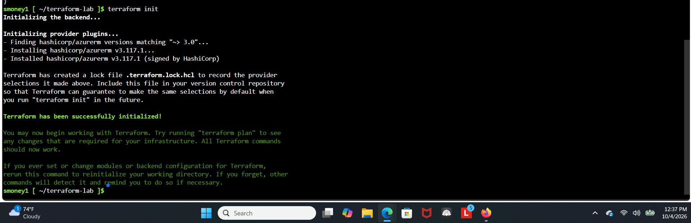

**`terraform plan`** showed every resource marked with a green `+`. Values like `id` show as `(known after apply)` because Azure only assigns them once the resource exists.

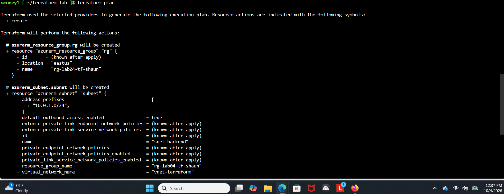
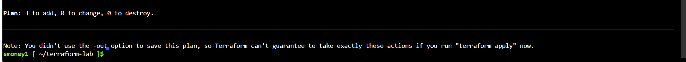

**`terraform apply`** showed the plan again and only accepted the full word `yes` to continue.

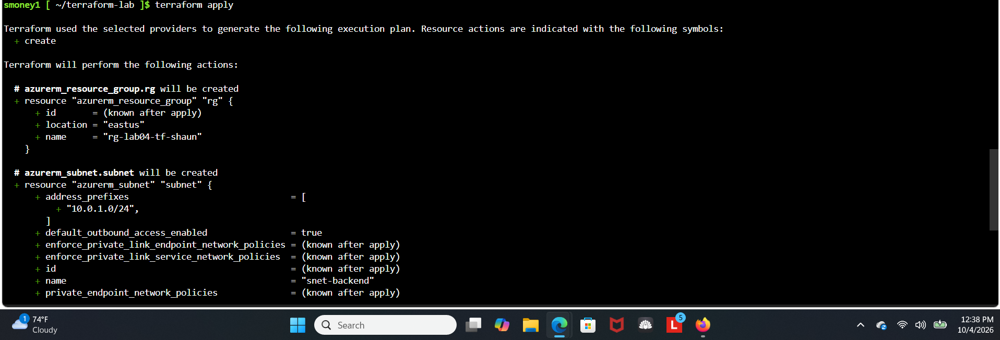
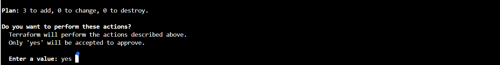

Terraform built the resources one after another in dependency order — resource group (12s), then VNet (5s), then subnet (4s):

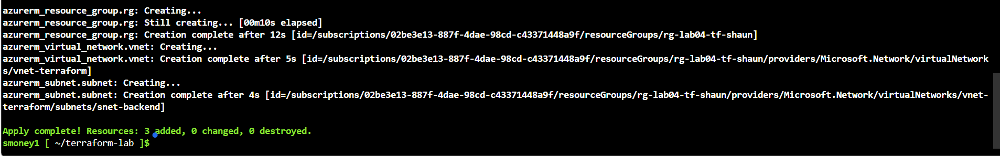

### Phase 4: Verify in the portal

`rg-lab04-tf-shaun` showed up in East US, created entirely from code:


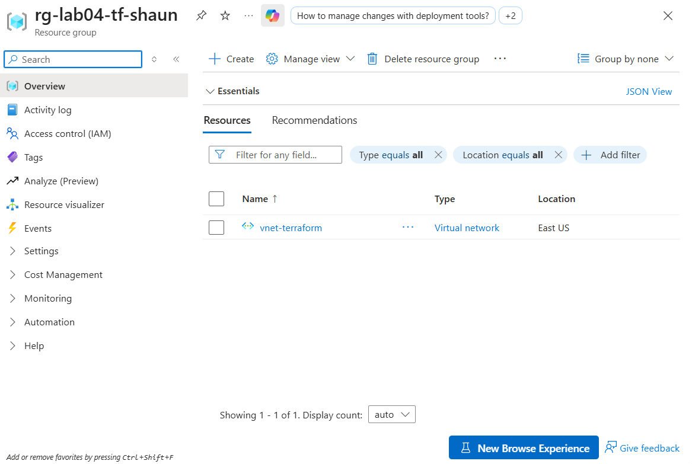

The subnet doesn't appear as its own row because it's a child of the VNet — it lives under the VNet's **Subnets** blade. Terraform still tracks it as a separate resource, which is why it counted toward "3 added."

### Phase 5: Change the live environment

This is the part that shows why Infrastructure as Code matters. Instead of creating the NSG in the portal, I added it to the config and let Terraform figure out what was different.


I added one block at the bottom and left everything above it alone. The file list on the left also shows `terraform.tfstate`, written by the first apply:

```hcl
resource "azurerm_network_security_group" "nsg" {
  name                = "nsg-web"
  location            = azurerm_resource_group.rg.location
  resource_group_name = azurerm_resource_group.rg.name
}
```

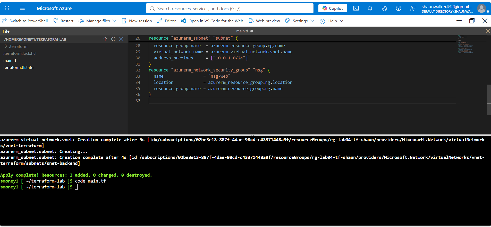

`terraform plan` first **refreshed state** on the three existing resources, then planned exactly one addition:

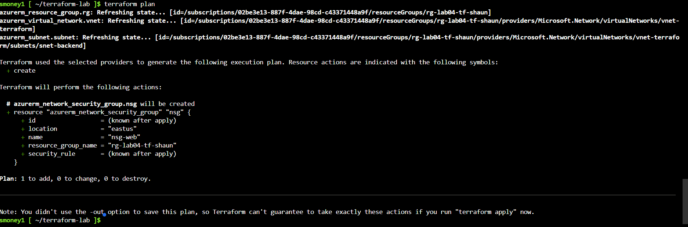
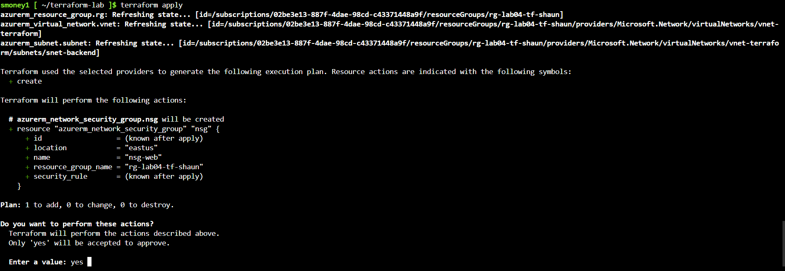

After a refresh, `nsg-web` appeared next to `vnet-terraform`:

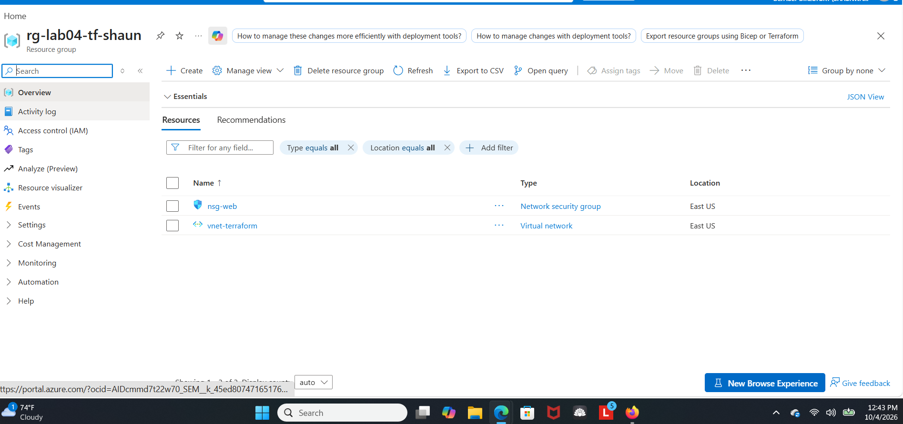

### Clean-up: terraform destroy

Instead of deleting the resource group in the portal like Labs 02 and 03, I let Terraform remove everything it manages.

```bash
terraform destroy
```

Terraform refreshed all four resources and marked each with a red `-`:

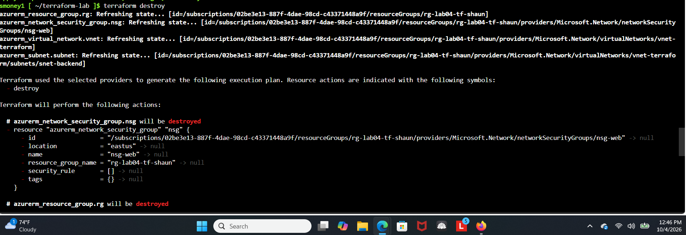
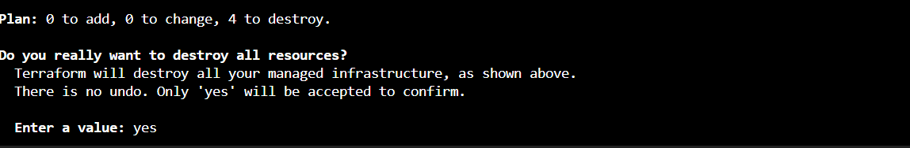
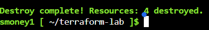

Back in the portal, `rg-lab04-tf-shaun` was gone. Only `NetworkWatcherRG` remains, which Azure creates on its own and wasn't part of this lab.

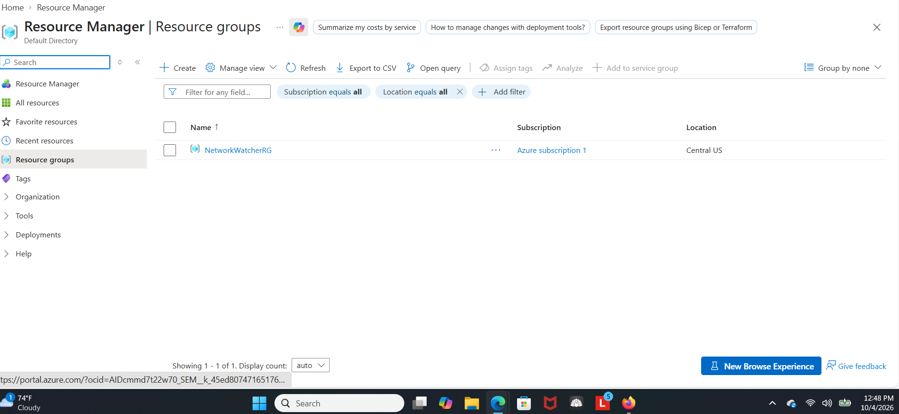

---

## Notes and Decisions

- **Two items in the portal, four resources in Terraform.** After Phase 5 the portal listed only `nsg-web` and `vnet-terraform`. That's expected: the resource group is the container itself, and the subnet lives inside the VNet. Terraform counts all four, which is why `destroy` reported 4.
- **The NSG has no rules.** It was added to prove the incremental-change workflow, not to filter traffic, and it isn't associated with the subnet.
- **State files are not committed.** The repo's `.gitignore` already excludes `.terraform/`, `*.tfstate`, and `*.tfvars`, so only `main.tf` is in this folder. State files can contain resource IDs and sometimes secrets.
- **No saved plan file.** Terraform warned that I didn't use `-out`, so `apply` recalculates the plan instead of running a saved one. That's fine for a solo lab; on a team you'd save the plan so what was reviewed is exactly what gets applied.
- **No "1 added" screenshot for the NSG apply.** I captured the `yes` prompt but not the completion line; the portal screenshot showing `nsg-web` confirms it was created.

## Troubleshooting Reference

| Symptom | Likely cause | Fix |
|---|---|---|
| "Resource Group already exists" | Name already used in this subscription | Rename it in `main.tf`, or delete the existing one first |
| `terraform: command not found` | Cloud Shell session dropped Terraform | Close and reopen Cloud Shell from the portal toolbar |
| Syntax error on a line number | Missing `}` or `"`, or a stray character | Reopen `code main.tf` and check every `{` has a matching `}` |
| `terraform plan` shows 0 to add | State file already records these resources as existing | Run `terraform destroy` first for a clean rebuild |
| `terraform apply` fails partway through | A transient Azure API error or quota limit | Run `terraform apply` again — it skips what exists and retries the rest |
| Editor won't close with `Ctrl+Q` | Browser intercepts the shortcut | Click the X in the editor panel's corner instead |

## Key Concepts Recap

- **Declarative vs. imperative:** the portal is a list of steps ("click here, then here"); Terraform is a description of the end result ("a resource group named X in East US"), and Terraform works out the steps.
- **`terraform init`** downloads the provider plugin. Terraform doesn't know how to talk to Azure by itself — the AzureRM provider translates resource blocks into Azure API calls.
- **`terraform plan` vs. `apply`:** plan is read-only and only shows what would change; apply actually makes the changes after a typed `yes`.
- **`terraform.tfstate`** is Terraform's record of what it created, mapped to real Azure resource IDs. Deleting it by hand means Terraform loses track — the next apply would try to recreate everything and collide with what already exists.
- **Why Phase 5 showed 1 to add, not 4:** the state file already recorded the other three, Terraform confirmed they still matched the config, and only the new block was different.
- **Why `destroy` instead of the portal:** destroy removes the resources *and* updates state in one step. Deleting in the portal leaves state pointing at resources that no longer exist.

## What I Learned

- A single text file replaced every portal form from Labs 02 and 03, and the same file can rebuild the identical environment any time.
- Resource references do double duty: they pass values between resources *and* define build order.
- Reading the plan before typing `yes` is the whole safety model — the plan in Phase 5 proved nothing existing would be touched before anything happened.
- Infrastructure becomes reviewable and version-controlled like code, which is why `main.tf` lives in this repo and the state file doesn't.

## Possible Next Steps

- Add a real security rule to `nsg-web` and associate it with `snet-backend`
- Move hardcoded names and the region into `variables.tf`, and expose resource IDs through `outputs.tf`
- Store state remotely in an Azure Storage account so it isn't tied to one Cloud Shell session
- Rebuild the Lab 02 two-tier network or the Lab 03 Key Vault + Managed Identity pattern in Terraform
