# Lab 05: Governance and Security Hardening

I set up the three guardrails every Azure environment needs: **who can do what** (RBAC), **what can be deployed** (Azure Policy), and **how much can be spent** (a budget with alerts). Then I tested them, which turned out to be the most valuable part of the lab, because one test didn't prove what I thought it proved.

| | |
|---|---|
| **Difficulty** | Intermediate |
| **Time** | About 25 minutes (my run: 5:10 AM to 5:33 AM) |
| **Region** | Central US (resource group) |
| **Concepts** | RBAC, least privilege, Microsoft Entra ID, Azure Policy, Cost Management, NIST CSF |

---

## Objective

Create a test "Junior Developer" user with view-only access to one resource group, prove that user can't create anything, assign a policy that only allows small VM sizes, set a $50 monthly budget with early-warning alerts, and clean everything up, including the test identity.

## Architecture

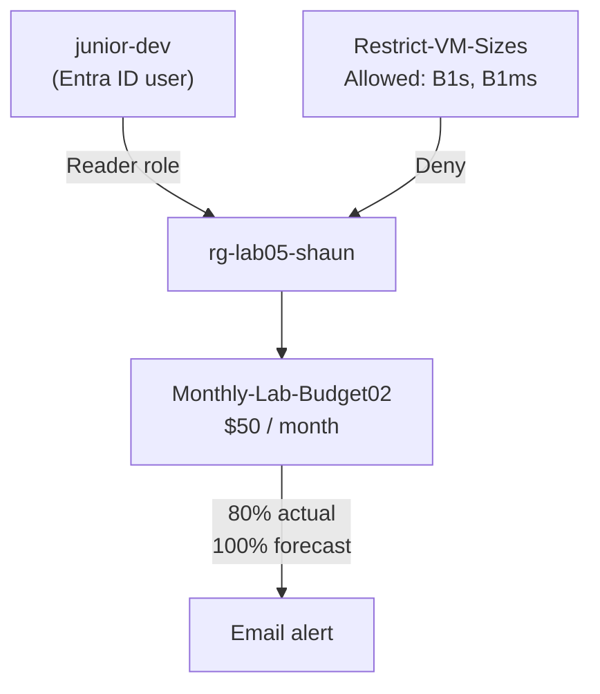

Each control covers a different gap: **RBAC limits people, Policy limits configurations, and the budget limits surprises.** The budget only alerts; it never stops spending.

## Where This Fits in the NIST Cybersecurity Framework

| NIST function | Plain English | Where it shows up in this lab |
|---|---|---|
| **Identify** | Know what you have and who has access | Creating the Junior Developer user in Entra ID |
| **Protect** | Limit what can go wrong | The Reader role and the VM size policy |
| **Detect** | Notice when something is off | The budget alerts |
| **Respond** | Act when something goes wrong | Investigating after an alert email |
| **Recover** | Get back to a known-good state | Deleting the test user and resource group |

## Skills Demonstrated

- Creating a user in **Microsoft Entra ID**
- Assigning a built-in **RBAC role (Reader)** at resource group scope
- Testing **least privilege** by signing in as the restricted user in an incognito window
- Assigning a built-in **Azure Policy** definition with custom parameters
- Creating a **budget** with both an Actual and a Forecasted alert
- Reading an `AuthorizationFailed` error closely enough to tell *which* control caused it
- Cleaning up identities as well as resources

## Resources Deployed

| Item | Name | Notes |
|---|---|---|
| Resource group | `rg-lab05-shaun` | Central US |
| Test user | `junior-dev-shaun` | Display name `junior-dev` |
| Role assignment | Reader | Scoped to `rg-lab05-shaun` |
| Policy assignment | `Restrict-VM-Sizes` | Built-in "Allowed virtual machine size SKUs" |
| Allowed VM sizes | `Standard_B1s`, `Standard_B1ms` | |
| Budget | `Monthly-Lab-Budget02` | $50/month, alerts at 80% actual and 100% forecasted |

---

## Walkthrough

### Phase 1: Resource group

Created `rg-lab05-shaun` in **Central US**. Every role, policy, and budget in this lab is aimed at this one group so nothing leaks into the rest of the subscription.

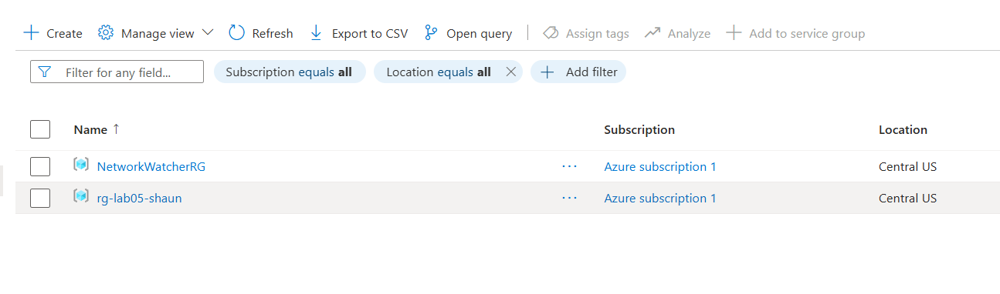

### Phase 2: Create the user and assign Reader

Searched for **Microsoft Entra ID**, Azure's identity service, and created a new internal user:

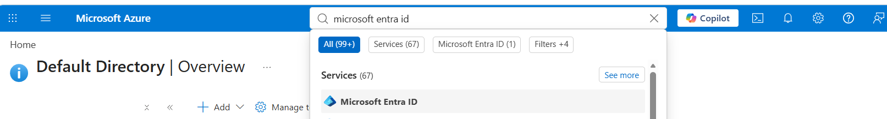
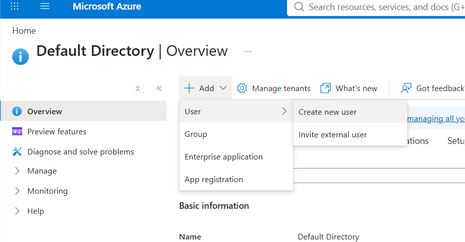
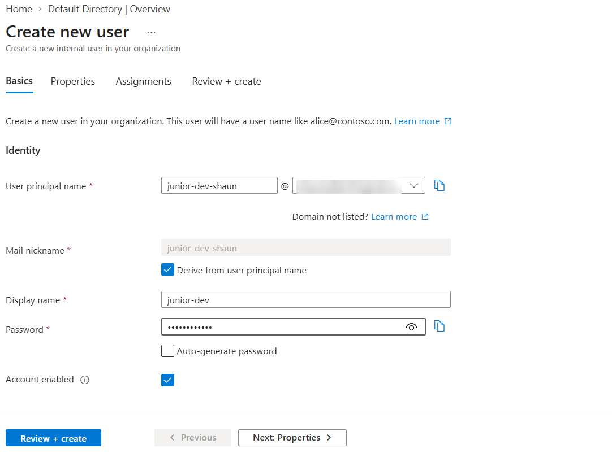

Creating a user grants nothing on its own. Azure is **deny by default**, so access only exists once a role is assigned. I went to the resource group's **Access control (IAM)** and assigned **Reader** to `junior-dev`:

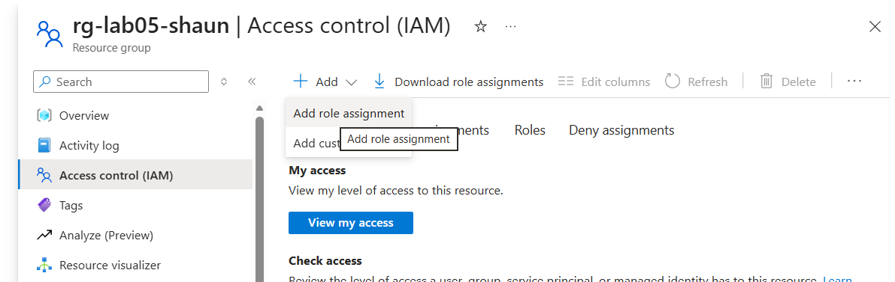
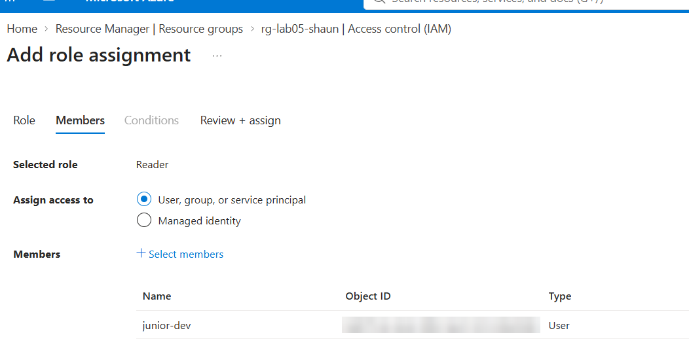

### Phase 3: Prove it with the permission-denied test

A control you never test is a control you can't trust. I opened an incognito window and signed in as the Junior Developer:

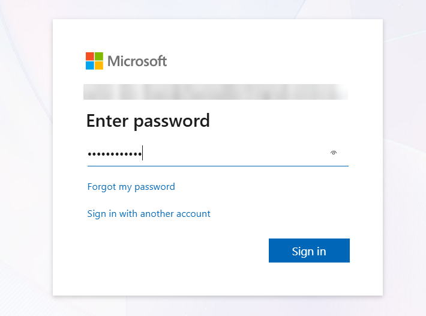

Then I tried to create a storage account (`stlab05shaun`) in the lab resource group:

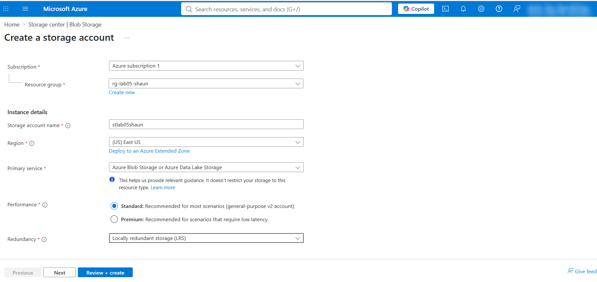

Validation failed with **`AuthorizationFailed`**: the user doesn't have permission for `Microsoft.Resources/deployments/validate/action`. This error is the pass condition. It proves Reader really is read-only.

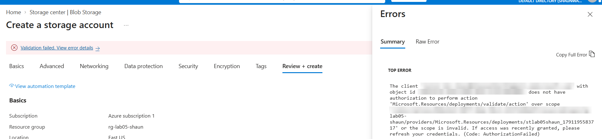

### Phase 4: Assign the VM size policy

Back on my main account, I opened **Policy → Assignments**. The only existing assignment was Azure's default Defender for Cloud initiative.

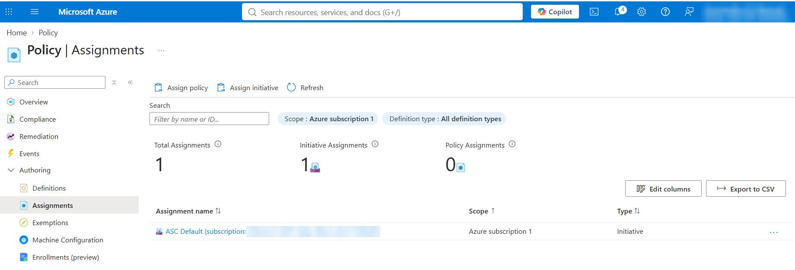
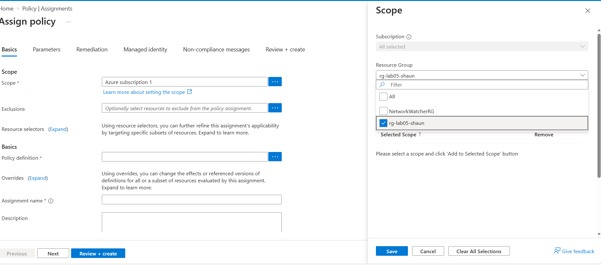

I picked the built-in **Allowed virtual machine size SKUs** definition and named the assignment `Restrict-VM-Sizes`:

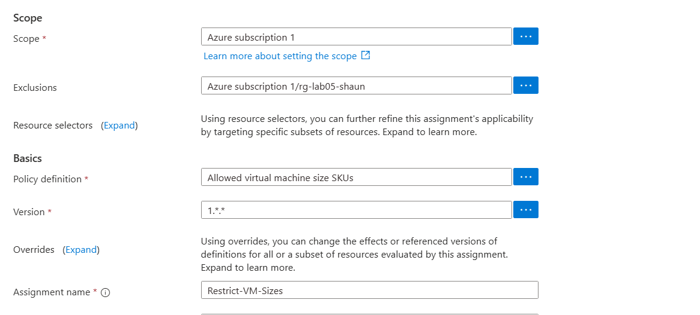

On the Parameters tab I allowed only the two smallest burstable sizes, **Standard_B1s** and **Standard_B1ms**:

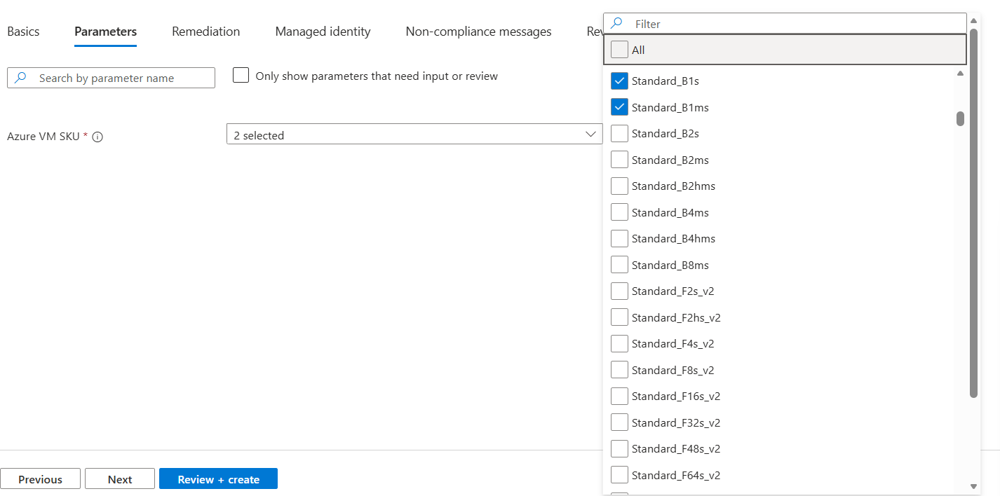

> ⚠️ Look at the Scope and Exclusions fields in screenshot 12. That detail matters; see [the mistake section](#️-a-mistake-im-documenting-honestly) below.

### Phase 5: Test the policy

I started a VM called `testlab05-shaun` in `rg-lab05-shaun` and picked **Standard_D4als_v7** (4 vCPUs, about $117/month), a size that isn't on the allowed list:

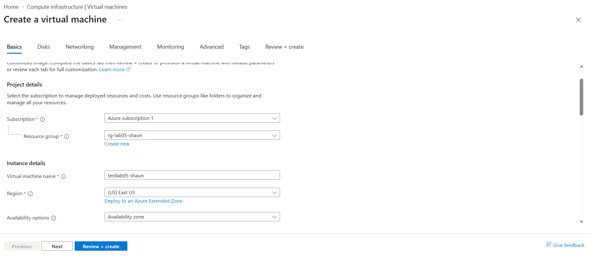
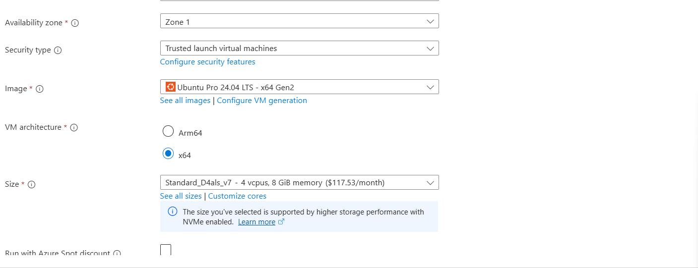

Validation failed:

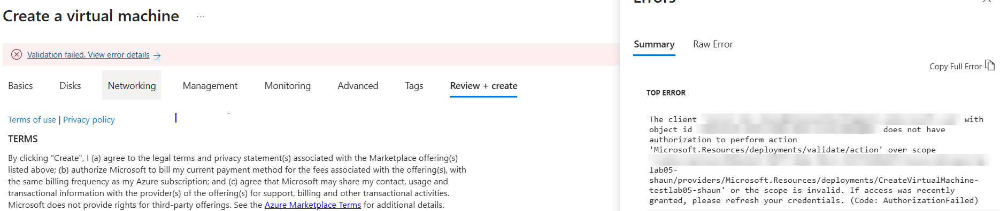

But this is **`AuthorizationFailed` for `junior-dev-shaun`**, the same RBAC error as Phase 3, not a policy denial. More on that below.

### Phase 6: Budget with two alerts

On the resource group's **Budgets** page I created `Monthly-Lab-Budget02`: $50, resetting monthly.

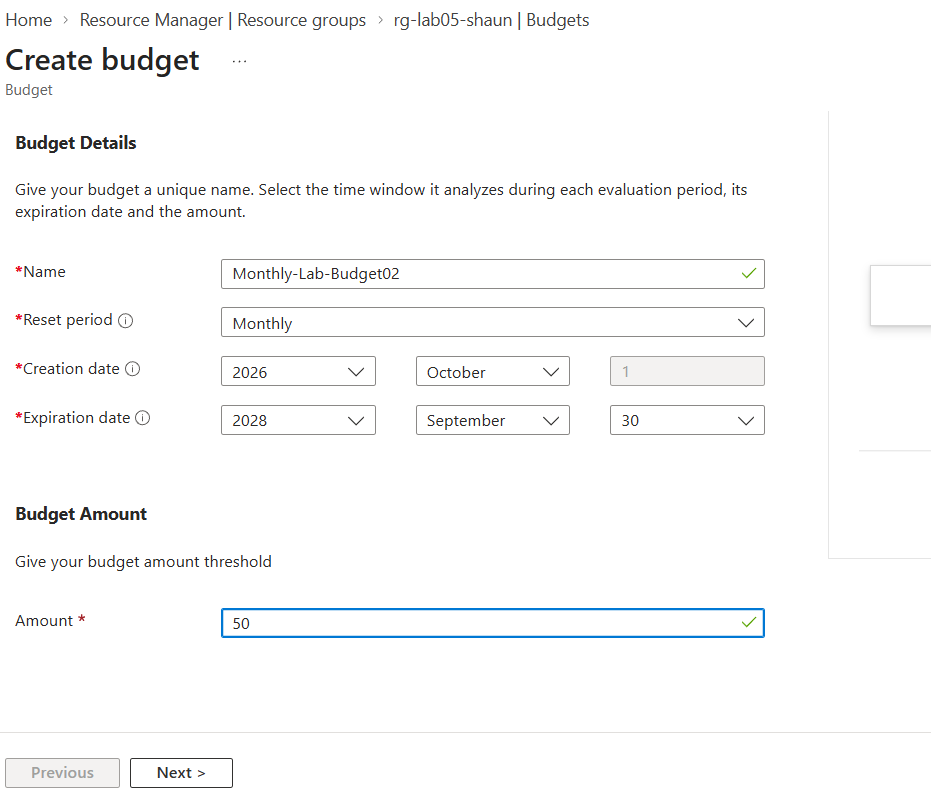

Two alert conditions, both emailing me:

| Type | Threshold | Fires when |
|---|---|---|
| Actual | 80% ($40) | $40 has already been spent |
| Forecasted | 100% ($50) | The current trend projects going over $50 this month |

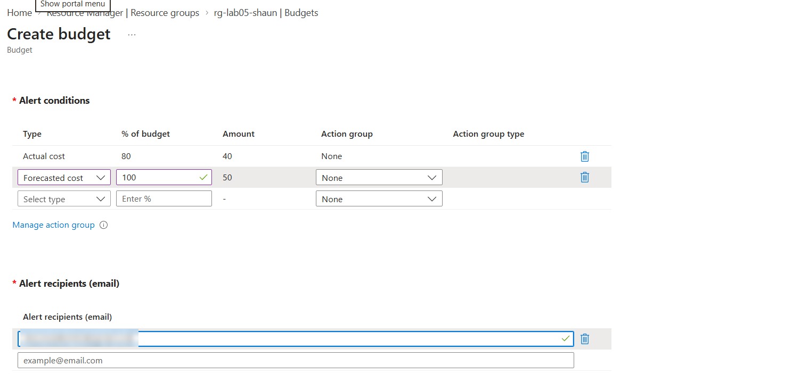

Actual alerts give ground truth after the fact. Forecasted alerts give a warning *before* the money is spent.

### Clean-up

Deleted the resource group, which takes the role assignment and budget with it:

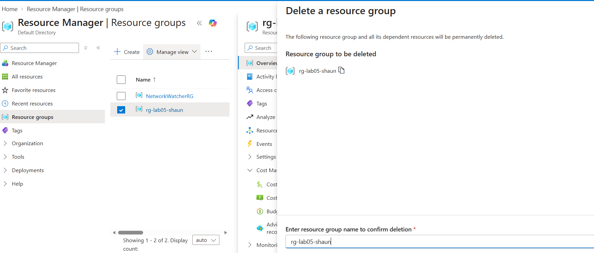

Then deleted the test user separately in Entra ID. Users aren't inside resource groups, so deleting the group doesn't remove them, and a leftover unused account is attack surface even with no resources attached.

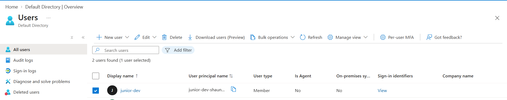

---

## ⚠️ A Mistake I'm Documenting Honestly

My policy test in Phase 5 **didn't actually test the policy.** Two things went wrong, and either one alone would have made the result meaningless.

**1. I ran the test as the wrong user.** I was still signed in as `junior-dev-shaun` when I tried to create the VM. A Reader can't create anything, so Azure stopped the request at the RBAC check before Policy was ever evaluated. The error proves the same thing Phase 3 already proved, and nothing new. A policy denial looks different: it names the policy assignment (`Restrict-VM-Sizes`) and says the request was disallowed by policy.

**2. The policy was pointed at the wrong place.** Screenshot 12 shows **Scope: Azure subscription 1** and **Exclusions: Azure subscription 1/rg-lab05-shaun**. That's the opposite of what I intended. It applies the rule to every resource group in the subscription *except* the lab one. In screenshot 11 I had `rg-lab05-shaun` checked in the scope picker, but it doesn't look like it was added to the selected scope, and the group ended up in Exclusions instead. So even from my admin account, the D4als_v7 VM in `rg-lab05-shaun` would most likely have passed.

**What I'd do differently:**

- Run the policy test from my **main account**, so RBAC isn't the thing blocking me.
- After clicking the resource group in the scope picker, click **Add to Selected Scope** and confirm the Scope field shows `.../rg-lab05-shaun` with **Exclusions empty**.
- Wait 10 to 30 minutes after assigning, then test both directions: `Standard_D4als_v7` should fail with a message naming `Restrict-VM-Sizes`, and `Standard_B1s` should pass.

**The lesson:** read the error, not just the red banner. "Validation failed" told me something was blocked; only the error details tell you *which* control did it. In a real environment, mistaking an RBAC block for a working policy would leave a gap nobody knows about.

---

## Notes and Decisions

- **Names differ slightly from the lab guide.** Resource group is `rg-lab05-shaun` (not `rg-lab05-gov-shaun`), the user's display name is `junior-dev`, and the budget is `Monthly-Lab-Budget02`.
- **Region:** the resource group is in Central US, while the storage account and VM tests used East US. A resource's region doesn't have to match its resource group's region; the group is just a container.
- **Test VM size:** I used `Standard_D4als_v7` instead of the guide's `Standard_D2s_v3`. Both are outside the allowed list, so either works for the test.
- **Screenshots are redacted.** My email, tenant domain, subscription ID, and the test user's object ID are blurred.

## Troubleshooting Reference

| Symptom | Likely cause | Fix |
|---|---|---|
| Junior Developer can still create resources | Role assigned at the wrong scope, e.g. the whole subscription | Check IAM → Role assignments on the resource group |
| VM test fails with `AuthorizationFailed` | You're signed in as the Reader user, so RBAC blocks it before Policy runs | Run the policy test from your main account |
| Policy isn't blocking a disallowed size | Not propagated yet, **or** the resource group is in Exclusions instead of Scope | Wait 15–30 minutes, then check the assignment's Scope and Exclusions under Policy → Assignments |
| Can't find Budgets in the resource group menu | Not shown for every subscription type | Use Cost Management + Billing from the search bar |
| Incognito sign-in asks for authenticator setup | Entra ID requires MFA on first sign-in | Complete it; this is the Protect function working |
| Budget creation fails on permissions | Account lacks Cost Management write access | Check for Cost Management Contributor or Owner |

## Key Concepts Recap

- **RBAC controls who can act.** Roles bundle permissions (Owner, Contributor, Reader), and a role only applies inside its **scope**.
- **Least privilege:** give the minimum access needed. **Deny by default:** a new user can do nothing until a role is assigned.
- **Azure Policy controls what can be deployed,** no matter who is deploying. A Deny policy blocks even Owners, which is why it can't be bypassed by raising your own permissions.
- **Definition vs. assignment:** a policy definition is the rule; it does nothing until it's assigned to a scope.
- **Exclusions carve holes in a scope.** Anything excluded is untouched by the policy.
- **A budget is a smoke detector, not a fire department.** It alerts; it doesn't stop resources or block deployments. Automatic action requires an action group.
- **Layered defense:** RBAC stops the wrong *people*, Policy stops the wrong *configurations*, and the budget catches whatever slips through, including a compromised account spending money.

## What I Learned

- Creating a user and granting access are two separate steps, and the second is the one that matters.
- Testing a control means confirming *that specific control* caused the result. Two different controls can both produce a red "Validation failed" banner.
- Scope and Exclusions sit right next to each other on the policy form, and mixing them up flips the policy's effect.
- Clean-up has two parts: resources live in resource groups, but identities live in Entra ID and need to be removed on their own.

## Possible Next Steps

- Redo the policy assignment scoped directly to the resource group with no exclusions, then re-run the VM test from my main account and capture the real `RequestDisallowedByPolicy` error
- Test the allowed direction too, confirming `Standard_B1s` passes validation
- Add an **action group** to the budget so an alert can trigger automation, not just an email
- Assign the same Reader role and policy with Terraform, building on Lab 04
